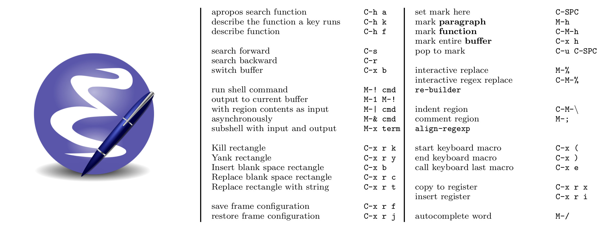

Emacs Mug
=========

Here is a jpg low resolution version of the [pdf](emacs-refmug.pdf) file you print on your mug:


Modify and build you own version
-------

Edit the [emacs-refmug.tex](emacs-refmug.tex) and build the pdf with the following command:
```pdflatex emacs-refmug.tex```
